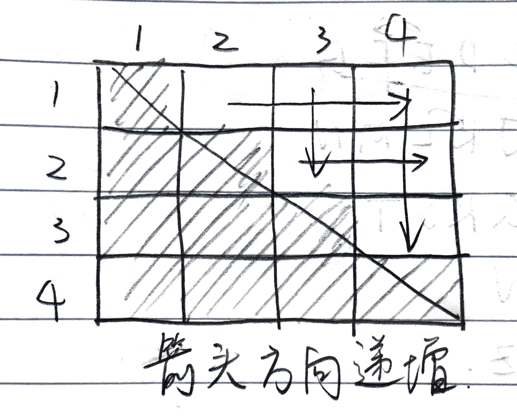

##  Two Sum

> Given an array of integers, return **indices** of the two numbers such that they add up to a specific target. 
>
> You may assume that each input would have **exactly** one solution, and you may not use the *same* element twice.

### Solutions

**Brute Force**

The brute force way is to traverse each pair in two nested loops.

* Time:  $O(n^2)$
* Space:  $O(1)$

**One Pass with Hash Table**

The reason why we need a second nested loop is that we don't remember the values we have gone through. We can simply store the difference and its index in a hash map. For example, when going through the array of `[2, 7, 11, 15]` and we want the target of `18`, we store a map like `{16: 0, 11: 1, 7: 2, 3: 3}`.

* Time: $O(n)$
* Space: $O(n)$

```java
public int[] twoSum(int[] nums, int target) {
    Map<Integer, Integer> m = new HashMap<>();
    for (int i = 0; i < nums.length; i++) {
        if (m.containsKey(nums[i])) {
            return new int[] {m.get(nums[i]), i};
        }
        m.put(target - nums[i], i);
    }
    throw new RuntimeException("Unable to find a solution!");
}
```

**Sort and Two Pointers**

If the array is sorted, we can identify there is some extra work using the brute force. Take the `[2, 7, 11, 15]` as an example.

| #    | Iterations               | Min          | Max          |
| ---- | ------------------------ | ------------ | ------------ |
| 1    | [2, 7], [2, 11], [2, 15] | 2 + 7 = 9    | 2 + 15 = 17  |
| 2    | [7, 11], [7, 15]         | 7 + 11 = 18  | 7 + 15 = 22  |
| 3    | [11, 15]                 | 11 + 15 = 26 | 11 + 15 = 26 |

In row #1, if we know the target is 18 which is larger than the max 17, then we don't need to go through the pairs with 2 in it at all. The question is how we should start the search?

A way to think about it is that we can visualize it below. If we have two pointers and point them to the first and last item respectively, then we can starting from the "middle", and search like it's a tree, 



Note that the question asks us to return the indices, so we still need to copy the array.

Also note that we cannot use a hash table to store a value-to-index map, since there maybe duplicates. (Even though it says there is exactly one solution, we can still have something like `[5, 5]` with target `10`).

* Time: $O(nlogn)$
* Space: $O(n)$

```java
public int[] twoSum(int[] nums, int target) {
    int i = 0;
    int j = nums.length - 1;
    int[] numsSorted = Arrays.copyOf(nums, nums.length);
    Arrays.sort(numsSorted);
    while (i < j) {
        int sum = numsSorted[i] + numsSorted[j];
        if (sum > target) {
            j -= 1;
        } else if (sum < target) {
            i += 1;
        } else {
            // got the solution, find the original indices
            Integer idx1 = null;
            Integer idx2 = null;
            for (int p = 0; p < nums.length; p++) {
                if (idx1 == null && nums[p] == numsSorted[i]) {
                    idx1 = p;
                } else if (idx2 == null && nums[p] == numsSorted[j]) {
                    idx2 = p;
                }
            }
            return idx1 < idx2 ? new int[] {idx1, idx2} : new int[] {idx2, idx1};
        }
    }
    throw new RuntimeException("Unable to find a solution!");
}
```

### Follow up

Q1: What if we don't need to return the indices, just the value of the numbers?

Q2: What if it's not about adding up to a target; instead we want the difference of two numbers equals a target?

Q3: Find the number of pairs that have sum larger than a target?

---

Answers to the follow up questions

A1: The third solution will be $O(1)$ in space. For the second solution, we can replace the hash table with a hash set.

A2: Hash table solution works. If it's sorted, we can use two pointers with them both pointing the first element (or both pointing to last). If starting from the first element, increment the second pointer if the value is smaller than target, otherwise increment the first pointer.

A3: Two pointers. If the value is smaller the target, increment the first pointer; otherwise adding the elements on the right of the first pointers to the result, and then decrement the second pointer.